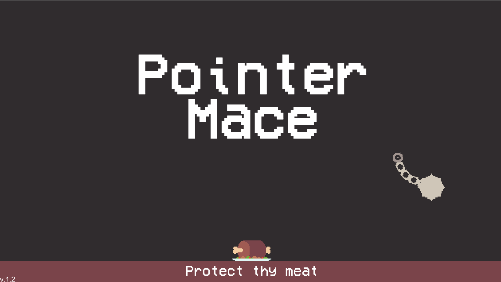
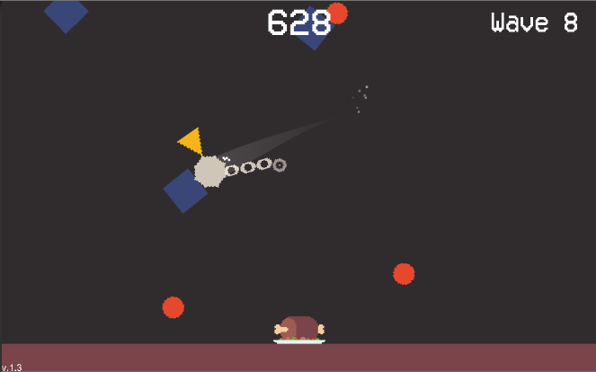

# Pointer Mace
## [👉 Click Here to Play in Browser(HTML5)](https://fishwash.github.io/pointer-mace/)

### Intro
Hero, evil shapes attacketh! 

They wish to eat thy MEAT!

Take up thy mace, protect thy meat!

### Controls
Mouse: Control mace 
*(The faster your mace is moving, the more damage it does)*
Esc: Pause

### Tools Used
- Game Engine: Coded by me in [Unity](https://unity.com/)
- Pixel Art: Drawn by me in [Aseprite](https://www.aseprite.org/)
- Pixel Animations: [Juice FX](https://codemanu.itch.io/juicefx)
- Sounds: [Freesound.org](https://freesound.org/) and [Audacity](https://www.audacityteam.org/)
- Music: Composed by [LMMS](https://lmms.io/)
- Font: [VCR OSD Mono](https://www.dafont.com/vcr-osd-mono.font)
